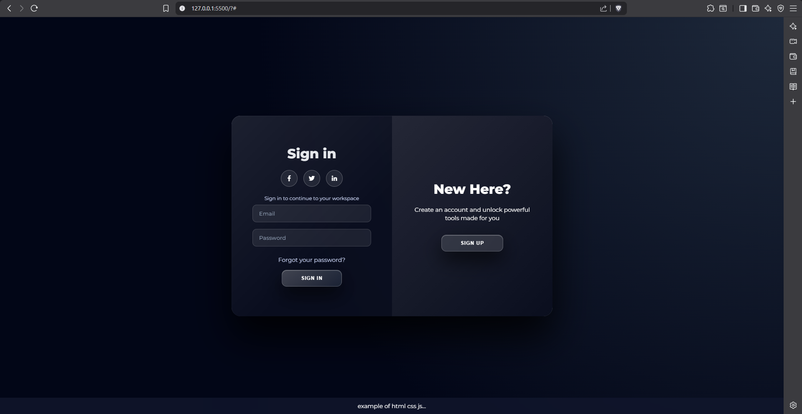
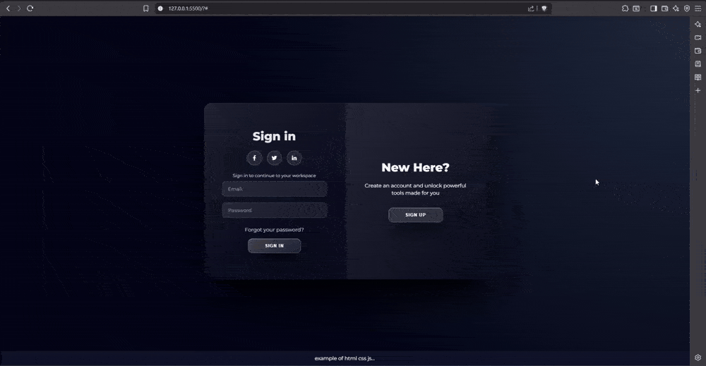

# Dynamic Login Page

A modern **dynamic login page** built for web development training and real-world front-end practice.  
This project demonstrates how a professional login interface is structured, styled, and handled dynamically using clean and maintainable code.

---

## 📌 Project Overview

This project is designed to help learners move beyond static forms and understand practical login workflows used in real applications.

---

## 🖼️ Screenshot

Below is a preview of the login interface:



---

## 🎥 Demo Video

A short demonstration of the login page functionality:



> _If the video does not play directly on your platform, please download and view it locally._

---

## 🛠️ Tech Stack

- **HTML5** – Semantic and accessible markup
- **CSS3** – Responsive layout and modern styling
- **JavaScript (ES6+)** – Dynamic behavior and form validation

---

## ✨ Key Features

- Responsive
- Clean and readable code structure
- Easy to extend with backend authentication

---

## 📂 Project Structure

```text
project-root/
│
├── assets/
│   ├── login.png
│   └── login-vid.mp4
│
├── index.html
├── style.css
├── script.js
└── README.md
```
